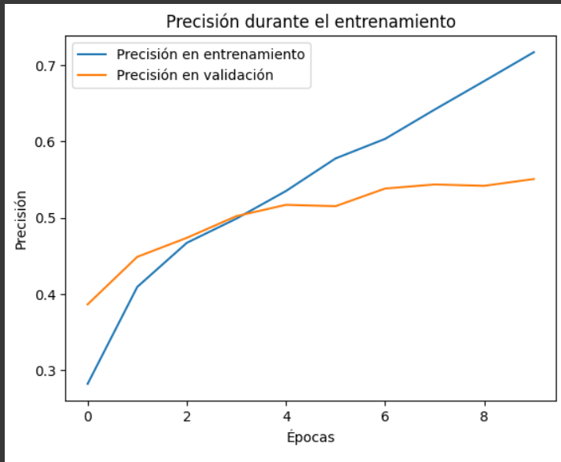

En este directorio adjuntamos algunos modelos que estuvimos trabajando, con datasets distintos, más o menos capas, etc.
Igual adjuntamos algunas gráficas y comportamientos de algunos modelos.

## Modelo 1 (clasificador_de_emociones.ipynb)
En este modelo trabajamos solo con dos datasets:
- [Facial Emotion Dataset](https://www.kaggle.com/datasets/dilkushsingh/facial-emotion-dataset)
- [Facial Emotion Expressions](https://www.kaggle.com/datasets/samaneheslamifar/facial-emotion-expressions)
Esto se eligió así debido a que tenía imágenes de mejor calidad y mejor etiquetadas según nuestro criterio, sin embargo no agregamos las gráficas de presición durante el entrenamiento y tampoco dividimos en el conjunto de prueba.

## Modelo 2 (clasificador1.ipynb)
En este modelo trabajamos con otros datasets, este fue de los primeros modelos y aún no estaba tan limpia la parte de crear los dataframes, igual aquí nos dimos cuenta que había datasets con imágenes que no podían ser trabajadas.

## Modelo 3 (copia_de_clasificador.ipynb)
Este modelo igual  fue trabajado con otros datasets y también con otra estructura, más simple y sin aumento de datos, lo que nos daba un peor rendimiento.

Esto nos arrojaba gráficas peores, con sobreentrenamiento y peores resultados:

Estos resultados nos hicieron descartar tanto el modelo como datasets.